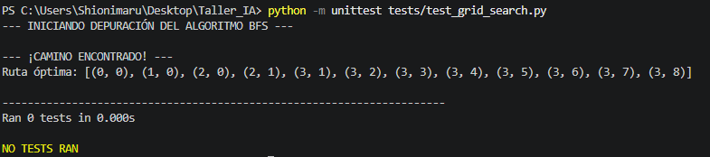

## 1. Evidencia de Depuración (Modo debug=True)

A continuación se presenta la captura de pantalla de la consola de Visual Studio Code ejecutando el algoritmo con el modo de depuración activado, mostrando cómo interactúan la frontera y los nodos visitados en la cuadrícula:

### Reflexión Final 

Durante el desarrollo de esta actividad, el error más difícil de depurar en Visual Studio Code fue la gestión de los índices de la matriz al expandir los nodos y el control de los límites del mapa, lo que inicialmente provocaba desbordamientos de rango (`IndexError`) o bucles infinitos al evaluar los obstáculos. A través de este proceso de depuración, se comprendió de manera práctica que la **frontera** actúa como la memoria activa que decide el orden de exploración, mientras que la lista de **visitados** es crucial para evitar redundancias y el diccionario de **padres** es el único mecanismo que permite reconstruir el camino correcto en reversa desde la meta. Finalmente, se evidenció que **A\*** es significativamente más eficiente que BFS debido a que este último realiza una búsqueda ciega y uniforme en todas las direcciones, expandiendo nodos innecesarios. En contraste, A\* utiliza una función de evaluación $f(n) = g(n) + h(n)$ apoyada en la heurística de Manhattan, lo que le permite priorizar los caminos que se orientan geométricamente hacia la zona segura, reduciendo drásticamente el espacio de búsqueda y el tiempo de cómputo.