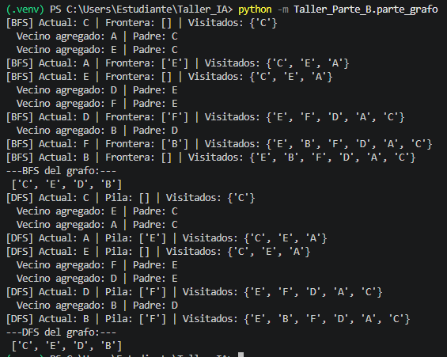

# Actividad Final: Rescate en un Mapa con Obstáculos
## Parte C: Reflexión y Evidencia de Depuración
## 1. Evidencia de Depuración (Modo debug=True)

A continuación se presenta la captura de pantalla de la consola de Visual Studio Code ejecutando el algoritmo con el modo de depuración activado, mostrando cómo interactúan la frontera y los nodos visitados en la cuadrícula:

## 2. Reflexión Final

¿Qué algoritmo fue más fácil de depurar?
El algoritmo más fácil de depurar fue BFS (Búsqueda en Anchura). Al basarse en una estructura de cola (FIFO), su comportamiento es completamente predecible y visual: se expande de forma radial, capa por capa, abarcando primero todos los nodos a distancia 1, luego a distancia 2, etc. Al imprimir la frontera en la consola, es muy sencillo rastrear si está siguiendo este orden geométrico. Si el algoritmo fallaba, notar el error era inmediato porque rompía ese patrón visual uniforme.

¿Qué error apareció con mayor frecuencia?
El error más común (y peligroso) fue registrar los nodos como "visitados" demasiado tarde. En las primeras pruebas, el nodo se agregaba al conjunto de visitados justo cuando era extraído de la frontera, en lugar de hacerlo cuando era descubierto (al meterlo en la cola).

Esto provocaba un fallo silencioso: un mismo nodo volvía a ser añadido por otros vecinos múltiples veces a la frontera antes de ser procesado. Como consecuencia, el algoritmo funcionaba pero consumía el triple de memoria, ralentizaba el sistema y corrompía el diccionario de padres, generando rutas finales erróneas o bucles redundantes.

¿En qué caso usarían BFS, DFS o A*?
BFS: Lo usaríamos en redes de comunicación o mapas donde todos los movimientos tengan el mismo costo (sin pesos) y sea un requisito obligatorio garantizar el camino más corto absoluto (por ejemplo, para calcular el menor número de saltos entre enrutadores en una red local).

DFS: Es ideal para escenarios de exploración total donde la memoria RAM sea muy limitada, como juegos de resolución de laberintos profundos o detección de ciclos en circuitos. Dado que usa una pila, su consumo de memoria espacial es mucho menor que el de BFS, aunque no asegure la ruta más corta.

A*: Es la opción definitiva para sistemas de navegación (como GPS) y desarrollo de videojuegos en mapas con terrenos complejos y obstáculos. Al usar la heurística Manhattan o Euclidiana, "sabe" en qué dirección aproximada está la meta, lo que evita explorar zonas irrelevantes del mapa y ahorra una cantidad enorme de tiempo de cómputo.